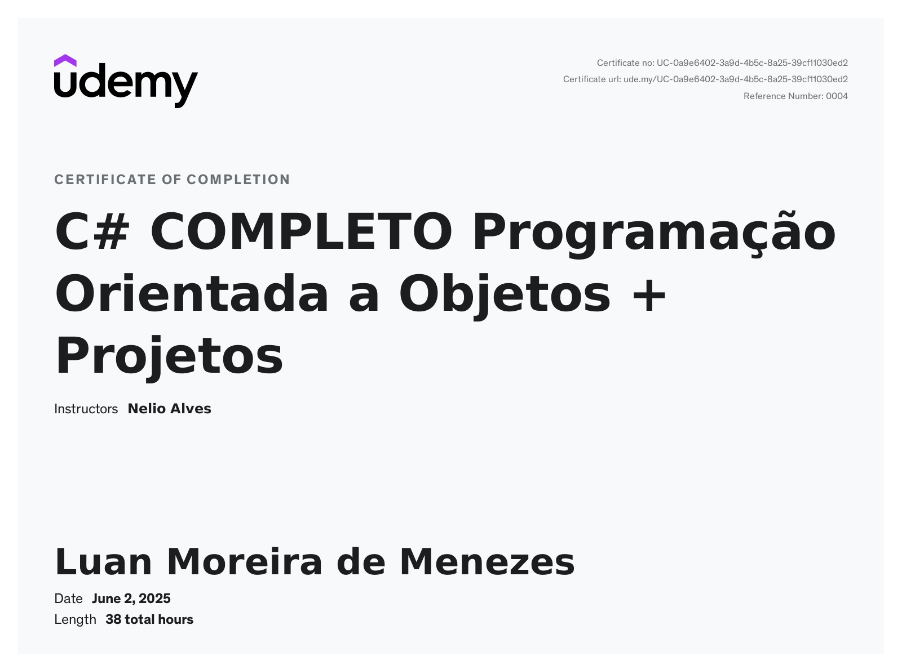

# Curso Concluído: C# COMPLETO – Programação Orientada a Objetos + Projetos

## Resumo

Curso completo de C# com foco em Programação Orientada a Objetos, abordando desde o básico até conceitos avançados como interfaces, herança, polimorfismo, LINQ, lambda, delegates e princípios SOLID.

## Principais Aprendizados

- Fundamentos da linguagem C#
- Conceitos de orientação a objetos: abstração, encapsulamento, herança e polimorfismo
- Uso de interfaces, classes abstratas e métodos override
- Trabalhos com listas, arquivos, datas e expressões lambda
- Aplicação de LINQ e delegates
- Princípios SOLID e boas práticas de desenvolvimento
- Interpretação de diagramas UML
- Desenvolvimento de projetos práticos

## Projetos Realizados

- Sistema bancário com cadastro de contas
- Controle de produtos e pedidos
- Leitura e escrita de arquivos
- Aplicações com regras de negócio usando orientação a objetos

# Certificado:

